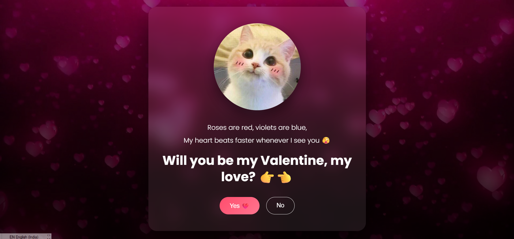

# 💘 Valentine — Interactive Web Experience

An immersive, animated "Will You Be My Valentine?" web experience designed with cinematic transitions, smooth UI interactions, and responsive layout.

Built as a playful yet polished front-end project demonstrating animation timing, DOM manipulation, and user experience design.

---

## ✨ Live Demo

🌐 https://YOUR_USERNAME.github.io/valentine/

---

## 🎯 Overview

This project is a lightweight interactive landing page where:

- Users are presented with a Valentine proposal
- The "No" button triggers progressive state changes
- The "Yes" button activates a smooth cinematic transition
- Background video updates dynamically without visual flicker
- All animations use controlled opacity transitions for a premium feel

The focus was on:
- Seamless UI transitions
- Zero white flash on background change
- Mobile-first responsiveness
- Clean structure without external libraries

---

## 🚀 Features

- 🎬 Smooth background video fade transitions  
- 💡 Controlled state-based interaction logic  
- 📱 Fully responsive across devices  
- 🎨 Modern glass-style UI  
- ⚡ Vanilla JavaScript (no frameworks)  
- 🧠 Clean and maintainable code structure  

---

## 🛠 Tech Stack

- HTML5
- CSS3 (Flexbox + transitions)
- Vanilla JavaScript (ES6)

No external dependencies.

---

## 📂 Project Structure

valentine/
│
├── index.html # Main entry file
├── style.css # Styling and transitions
├── script.js # Interaction logic
│
└── images/
├── i1.png
├── i3.png
├── i6.png
├── i8.png
├── i10.png
├── i17.png
└── v7.mp4

---

## ⚙️ How It Works

The application uses a simple state machine pattern:

- A step counter tracks interaction progress
- Conditional logic updates content dynamically
- Opacity transitions ensure smooth DOM updates
- Background video changes use fade-out → source swap → fade-in

No page reloads.
No route changes.
Pure DOM manipulation.

---

## 📱 Responsiveness

- Uses flexible containers
- Scales media dynamically
- Adapts layout for mobile, tablet, and desktop
- Prevents overflow and viewport flashing

---

## 🧩 Deployment

Deployed using GitHub Pages:

1. Push repository to GitHub
2. Enable Pages under Settings
3. Select `main` branch → `/ (root)`
4. Access via:

---

## 📸 Preview

---

## 🧠 What This Demonstrates

- UI/UX sensitivity to animation timing
- Proper asset structuring for static hosting
- Controlled interactive flow
- Clean vanilla JS architecture
- Production-ready static deployment

---

## 📜 License

This project is open for personal use and educational inspiration.
