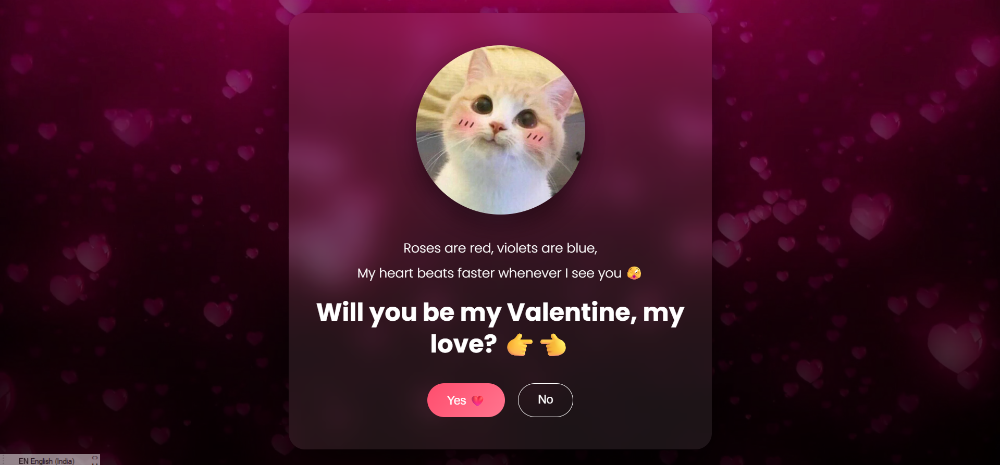

# Valentine Interactive Web Experience

A lightweight interactive Valentine-themed web experience built with pure HTML, CSS, and vanilla JavaScript.

The project is designed as a playful single-page interaction where user choices drive the messaging, visuals, and background media. The website code is intentionally kept simple and framework-free, with the main focus on animation smoothness, timing, and overall presentation.

## Live Demo

- GitHub Pages: [https://agarwalujala3-lang.github.io/VALENTINE-CHAUDHRAIN/](https://agarwalujala3-lang.github.io/VALENTINE-CHAUDHRAIN/)

## Preview



## Project Highlights

- cinematic background video presentation
- interactive Yes and No button flow
- smooth media fade transitions
- responsive layout for smaller screens
- fully static deployment with no external dependencies
- clean vanilla JavaScript DOM interaction

## Tech Stack

- HTML5
- CSS3
- Vanilla JavaScript

No framework, build tool, or package installation is required.

## How It Works

The page uses a simple interaction flow driven by JavaScript:

- the background video is updated with fade transitions
- text and image content change progressively based on user actions
- the interface stays on a single page with no route changes
- visual transitions are handled with CSS opacity and timing-based updates

This makes the project a good example of small-scale interactive frontend design using only core web technologies.

## Project Structure

```text
VALENTINE-CHAUDHRAIN/
|-- index.html
|-- style.css
|-- script.js
|-- README.md
`-- images/
    |-- ssV.png
    |-- v1.mp4 to v7.mp4
    `-- supporting image assets
```

## Run Locally

1. Clone the repository:

   ```bash
   git clone https://github.com/agarwalujala3-lang/VALENTINE-CHAUDHRAIN.git
   ```

2. Open the project folder.
3. Launch `index.html` in a browser.

Because this is a static project, no setup or dependency installation is needed.

## Responsiveness

The page includes responsive adjustments for smaller screens and keeps the interactive experience usable on mobile devices.

The core design focus, however, is the animated interaction flow rather than a large multi-section responsive application.

## What This Project Demonstrates

- DOM manipulation with vanilla JavaScript
- timing-based UI transitions
- video-based background presentation
- interaction state changes without page reloads
- lightweight static site architecture

## Future Improvements

- improve accessibility for buttons and dynamic content
- refine responsive spacing across more device sizes
- add clearer content labels and alt descriptions where appropriate
- introduce a cleaner asset naming system for long-term maintainability
- add a short interaction walkthrough GIF or video preview to the README

## License

No separate license file is currently included in this repository. If you want this project to be openly reusable, add an explicit license in a future update.
